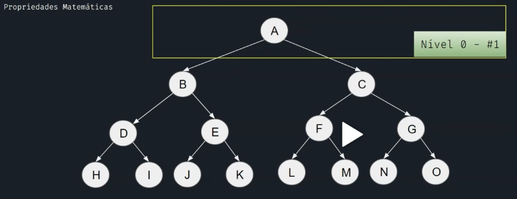

# Estrutura de Dados

## Tree (Árvore)

 WHAT'S TREE?

## Propriedades Matemáticas

1. Elementos por nível = 2^N (onde N = nível da árvore).
2. Elementos totais = 2^(N+1) - 1 .
3. Altura de uma árvore = N + 1 .

  

## Principal uso

O principal uso é no armazenamento de informação e na recuperação de dados.

## Principais Operações

1. Inicialização;
2. Inserir;

* Operações: Inicializar e Inserir Item (usar **queue**)
  * Para cada elemento da **fila**:
    * Se esquerda vazia
      * inserir item
    * senão
      * adicionar na fila
    * se direita vazia
      * inserir item
    * senão
      * adicionar na fila

3. É folha? (isLeaf);

4. Travessia;

   * pré ordem;
      * **RAIZ** - ESQUERDA - DIREITA
   * em ordem;
      * ESQUERDA - **RAIZ** - DIREITA
   * pós ordem;
      * ESQUERDA - DIREITA - **RAIZ**

5. Busca;

    * Busca em Largura (BFS);
      * Enquanto a **fila** possuir elemento:
          * Processa item
          * se esquerda não vazia
            * inserir item
          * se direita não vazia
            *inserir item

    * Busca em Profundidade (DFS);
      * O resultado da DFS é exatamente o mesmo da pré ordem;

## Conclusão

1. Estrutura dinâmica;
2. Não linear;
3. Armazenamento de informação;
4. Múltiplos algoritmos de busca e travessia;
